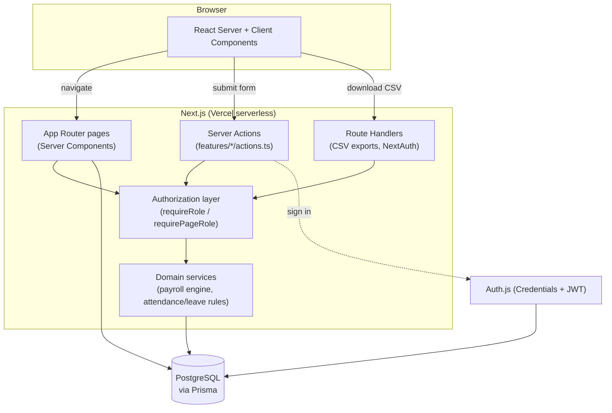
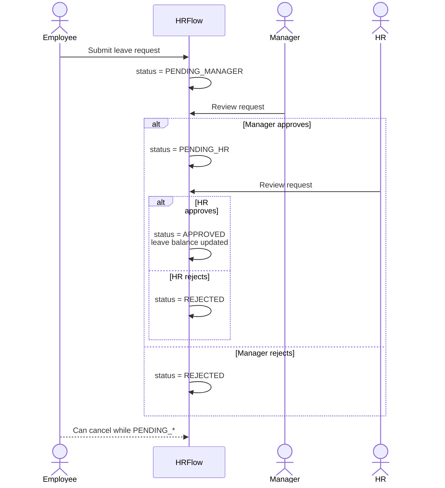

# HRFlow

A modular HR management platform covering employees, attendance, leave, and payroll in one place. Built as a portfolio/reference implementation demonstrating full-stack engineering practices: role-based access control enforced server-side, a multi-step approval workflow, a configurable payroll engine, and a relational schema with proper constraints.

> **Not for production HR use.** Payroll and tax calculations are simplified demo formulas. See [Limitations](#limitations) before using this for anything beyond a portfolio demo.

## Contents

- [Features](#features)
- [Architecture](#architecture)
- [Tech stack](#tech-stack)
- [Database design](#database-design)
- [Role permissions](#role-permissions)
- [Demo credentials](#demo-credentials)
- [Local installation](#local-installation)
- [Environment configuration](#environment-configuration)
- [Migration & seed](#migration--seed)
- [Testing](#testing)
- [Deployment (Vercel)](#deployment-vercel)
- [Limitations](#limitations)
- [Future improvements](#future-improvements)

## Features

- **Authentication & RBAC**: credentials-based login, JWT sessions, four roles (Admin/HR/Manager/Employee), server-side authorization on every page and mutation (not just hidden buttons).
- **Employee management**: full employee records (contact, address, emergency contact, banking/statutory placeholders), searchable/sortable/paginated roster, polished profile pages, create/edit/deactivate.
- **Attendance**: check-in/out with GPS/IP/device capture, configurable grace period and late detection, monthly summaries, team status view for managers/HR.
- **Leave management**: request workflow with an Employee → Manager → HR approval chain, a visual approval timeline, and automatic leave-balance tracking.
- **Payroll engine**: a pure, unit-tested calculation engine (base salary, overtime, allowances, bonuses, deductions, statutory withholding) wired into a Draft → Calculated → Reviewed → Approved → Paid workflow, with manual adjustments and CSV payment reports.
- **Payslips & tax document**: printer-friendly payslip and an annual tax summary (50 Tawi-inspired demo format).
- **Dashboard**: role-aware, with org-wide metrics and charts for Admin/HR, a team view for Managers, and a personal view for Employees.
- **Reports**: CSV exports for attendance, leave, employees, and payroll.
- **Audit log**: every sensitive mutation (payroll runs, approvals, employee changes, settings) is recorded with an actor and timestamp.
- **Settings**: admin-editable attendance and payroll rules, stored in the database (no redeploy needed to change them).
- **Bilingual (Thai / English)**: every screen, form, toast, and document is translated; the choice persists in a cookie and is applied server-side, so pages render in the right language on first paint. Inter covers Latin text and Noto Sans Thai fills in Thai glyphs, so mixed content stays legible.
- **Light / dark theme**: light by default, toggled from the topbar and remembered per browser.
- **Collapsible sidebar**: collapses to an icon rail with tooltips; the state persists across reloads via a cookie the server reads, so there's no flash of the wrong width.
- **Task-focused workspace**: role-aware page search and dashboard shortcuts, separate personal/team attendance tabs, grouped employee forms with section links and a persistent save bar, labeled filters with a reset action, and short guides for leave, payroll, and reports. Settings are split into attendance/payroll tabs. Shared controls have larger touch targets, tables scroll within their cards on mobile, and all new copy supports Thai and English.

## Architecture

Modular monolith: feature-based folders, business logic kept out of components, no microservices/Kafka/K8s overhead for a project this size.

```
src/
  app/                 # Next.js App Router routes (pages, layouts, route handlers)
    (app)/              # Authenticated app shell: dashboard, employees, attendance, leave, payroll, ...
    api/                # Route handlers (NextAuth, CSV exports)
    login/, unauthorized/
  components/
    ui/                 # shadcn/ui primitives
    layout/             # Sidebar, topbar, nav config
    shared/              # Cross-feature building blocks (DataTable, PageHeader, StatusBadge, ...)
  features/             # One folder per domain: employees, attendance, leave, payroll, reports, ...
    <feature>/
      actions.ts         # "use server" mutations: validate, authorize, write, audit-log, revalidate
      queries.ts          # Read-only data access (server-only), returns plain serializable shapes
      components/         # Feature-specific client/server components
  server/
    auth/                # NextAuth config
    authorization/        # Role/ownership permission predicates + requireRole/requirePageRole
    services/            # Domain services: payroll engine, attendance rules, leave rules, audit log
  db/                    # Prisma client singleton
  i18n/                  # Locale config, en/th dictionaries, server + client accessors
  validations/           # Zod schemas (server + client variants where coercion differs)
  lib/                   # Constants, formatting helpers
prisma/
  schema.prisma
  seed.ts
e2e/                    # Playwright end-to-end tests
```



### Leave approval workflow



## Tech stack

Next.js (App Router) · TypeScript (strict) · React · Tailwind CSS · shadcn/ui (Base UI primitives) · Prisma · PostgreSQL · Auth.js (Credentials) · Zod · React Hook Form · TanStack Table · Recharts · date-fns · Vitest · Playwright

## Database design

15 models, defined in [`prisma/schema.prisma`](prisma/schema.prisma):

- **Identity/org**: `User`, `Employee`, `Department`, `Position`
- **Attendance**: `Attendance`
- **Leave**: `LeaveType`, `LeaveBalance`, `LeaveRequest`, `LeaveApproval`
- **Payroll**: `PayrollRun`, `PayrollItem`, `PayrollAdjustment`, `Payslip`
- **Ops**: `AuditLog`, `CompanySetting`

Notable design choices:

- `Employee` has a self-relation (`managerId`) for the org chart, and an optional 1:1 to `User` (not every employee needs login access, though the seed gives everyone one).
- `LeaveBalance` is keyed by `(employeeId, leaveTypeId, year)`: a fresh balance per year, updated when a request is finally approved.
- `PayrollItem` stores the authoritative computed totals; `PayrollAdjustment` rows are an audit trail of manual line items folded into those totals.
- Money fields use `Decimal`, not `Float`, to avoid floating-point drift.
- `AuditLog.metadata` is a `Json` column for action-specific context without a table per action type.

## Internationalisation (Thai / English)

A deliberately lightweight setup, with no locale-prefixed routes and no extra dependency:

- `src/i18n/dictionaries/en.ts` is the **source of truth** for the dictionary shape. `th.ts` is typed against it, so a missing or renamed key is a build error rather than a key name leaking into the UI.
- The active locale lives in a cookie. `getDictionary()` reads it in server components; `I18nProvider` in the root layout hands the resolved dictionary down to client components via `useTranslations()`. Only the active locale's strings reach the browser.
- Server actions return **error codes**, not sentences (`{ error: "insufficientBalance", params: { ... } }`), because an action has no access to the locale-aware dictionary. The client turns the code into a localised message; see `src/features/leave/format-error.ts`.
- Dynamic column headers (TanStack Table) are built through `buildEmployeeColumns(t)` / `buildAttendanceColumns(t)` rather than module-level constants, so they follow the active locale.

To add a locale: add it to `LOCALES` in `src/i18n/config.ts`, create the dictionary file, and register it in `src/i18n/server.ts`. TypeScript will list every string still missing.

## Role permissions

| Capability | Admin | HR | Manager | Employee |
|---|:---:|:---:|:---:|:---:|
| Manage employees | ✅ | ✅ | ❌ | ❌ |
| View own profile | ✅ | ✅ | ✅ | ✅ |
| View team members | ✅ | ✅ | ✅ (own reports) | ❌ |
| Check in/out, view own attendance | ✅ | ✅ | ✅ | ✅ |
| Review team attendance | ✅ | ✅ | ✅ (own reports) | ❌ |
| Request leave | ✅ | ✅ | ✅ | ✅ |
| Approve leave (manager step) | ✅ | ❌ | ✅ (own reports) | ❌ |
| Approve leave (HR step) | ✅ | ✅ | ❌ | ❌ |
| Generate/approve/pay payroll | ✅ | ✅ | ❌ | ❌ |
| View own payslips | ✅ | ✅ | ✅ | ✅ |
| View others' payroll/payslips | ✅ | ✅ | ❌ | ❌ |
| Reports & audit log | ✅ | ✅ | ❌ | ❌ |
| Company settings | ✅ | ❌ | ❌ | ❌ |

Enforcement is server-side: every server action and page calls `requireRole`/`requirePageRole` or a permission predicate from `src/server/authorization`, independent of what the UI shows. Managers do **not** automatically get payroll access to their own reports; that's checked separately from general record access.

## Demo credentials

Every seeded account shares its role's password, so any of the ~27 seeded users can be used to explore that role, not just the four below.

| Role | Email | Password |
|---|---|---|
| Admin | `admin@hrflow.demo` | `Admin@12345` |
| HR | `hr@hrflow.demo` | `Hr@12345` |
| Manager | `manager@hrflow.demo` | `Manager@12345` |
| Employee | `employee@hrflow.demo` | `Employee@12345` |

The login page also has one-click demo-account autofill cards.

## Local installation

Prerequisites: Node.js 20+, a PostgreSQL database (a local Docker container works fine, see below), npm.

```bash
npm install
```

### Database setup

Any Postgres 14+ instance works. For local development with Docker:

```bash
docker run -d --name hrflow_postgres \
  -e POSTGRES_USER=hrflow -e POSTGRES_PASSWORD=hrflow_dev_password -e POSTGRES_DB=hrflow \
  -p 5432:5432 postgres:17-alpine
```

For production, use a serverless-friendly provider such as [Neon](https://neon.tech) or [Supabase](https://supabase.com). See [Deployment](#deployment-vercel).

## Environment configuration

Copy `.env.example` to `.env` and fill in the values:

```bash
cp .env.example .env
```

| Variable | Purpose |
|---|---|
| `DATABASE_URL` | PostgreSQL connection string |
| `AUTH_SECRET` | Session encryption key (generate with `openssl rand -base64 32`) |
| `NEXTAUTH_URL` | The app's base URL (must match the origin you're actually browsing to, see note below) |
| `DEMO_*_PASSWORD` | Passwords the seed script assigns to each role |

> **Dev-server note:** Auth.js resolves relative redirects (like the post-login redirect) against `NEXTAUTH_URL`, not the incoming request's host. If you run the dev server on a non-default port, update `NEXTAUTH_URL` to match, and always browse via `localhost` rather than `127.0.0.1`. Next.js 16 blocks the HMR handshake for other origins unless they're listed in `next.config.ts`'s `allowedDevOrigins`.

## Migration & seed

```bash
npm run db:migrate   # applies prisma/migrations, creates the schema
npm run db:seed      # seeds departments, ~27 employees/users, attendance, leave, payroll
```

The seed creates 1 Admin, 2 HR, 3 Managers, 20 Employees across 4 departments, ~30 days of attendance history, a handful of leave requests in various approval states, and two payroll runs (one paid, one in progress), enough to make every screen in the app show realistic data immediately after seeding.

Other useful scripts:

```bash
npm run db:studio    # Prisma Studio: browse the database
npm run db:push      # push schema changes without a migration (prototyping only)
```

## Testing

```bash
npm run test          # Vitest: business logic (payroll engine, attendance/leave rules) and permissions
npm run test:e2e      # Playwright: login, leave approval chain, payroll generation, RBAC redirects
```

Unit tests focus on pure, deterministic logic: payroll calculation, late-minute/working-hours math, business-day counting, and the role/ownership permission predicates, not on trivial component rendering. Playwright covers the flows a demo reviewer would actually click through: employee login, an employee submitting leave, a manager approving it, HR giving final approval, and HR generating a payroll run, plus a check that an employee is redirected away from the payroll section.

Playwright reuses whatever dev server is already running on the port in `.env`'s `NEXTAUTH_URL` (default 4200; override with `PLAYWRIGHT_PORT`), or starts one itself.

## Deployment (Vercel)

1. **Database**: provision a Postgres instance on [Neon](https://neon.tech) or [Supabase](https://supabase.com) (both work well with Vercel's serverless functions; avoid providers that don't pool connections).
2. **Import the repo** into Vercel.
3. **Environment variables**: set `DATABASE_URL`, `AUTH_SECRET`, `NEXTAUTH_URL` (your production URL) in the Vercel project settings.
4. **Build**: `npm run build` already runs `prisma generate` first; no extra build command needed.
5. **Migrate**: run `npm run db:migrate:deploy` against the production database (e.g. via `vercel env pull` + local run, or a one-off CI step) before the first deploy, and after any schema change.
6. **Seed (optional)**: run `npm run db:seed` against the production database once, if you want the deployed demo to show data immediately.

## Limitations

This is a portfolio/reference build. Before treating any of the following as production-ready:

- **Payroll & tax calculations are demo formulas**: flat-rate withholding tax, a simplified social security cap, and a 50 Tawi-inspired (not certified) annual tax summary. Real Thai payroll/tax rules are progressive, change yearly, and need a verified accounting implementation.
- **No company holiday calendar**: leave-day counting excludes weekends only, not public holidays.
- **PDF generation**: payslips/tax documents are print-ready HTML (browser print/"Save as PDF"), not server-generated PDF files, to avoid binary-dependency issues on Vercel's serverless runtime.
- **GPS on check-in/out** is captured if the browser grants permission, with no anti-spoofing. Fine for a demo, not for real attendance fraud prevention.
- **CSV, not native `.xlsx`**: "Excel-compatible" exports are CSV files, which Excel opens natively.

## Future improvements

- Company holiday calendar feeding into both attendance (`HOLIDAY` status) and leave-day calculation.
- Real progressive withholding-tax brackets, behind the same `CompanySetting`-driven configuration.
- Server-generated PDF payslips (e.g. via a headless-Chromium API route) if a Vercel-compatible approach is worth the added complexity.
- Bulk employee import/export.
- Notification emails for leave decisions and payslip issuance.
